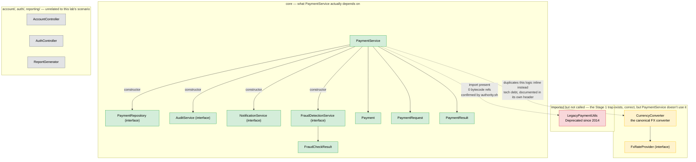
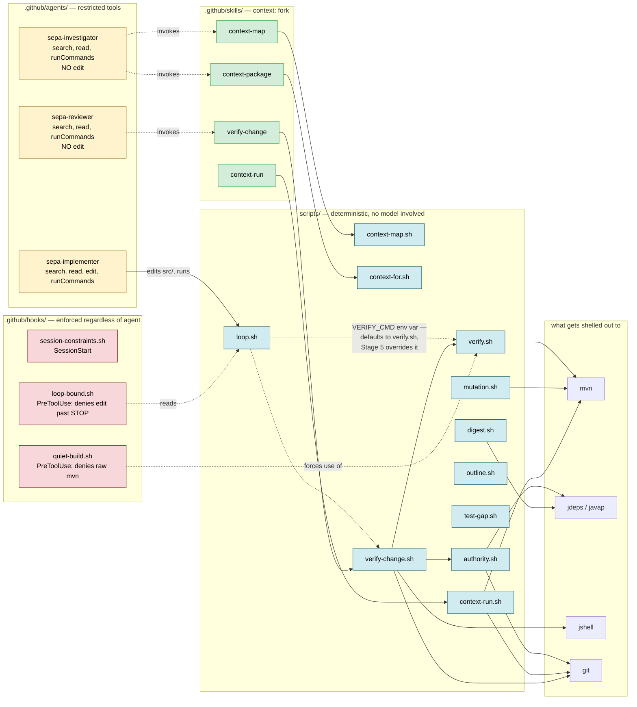
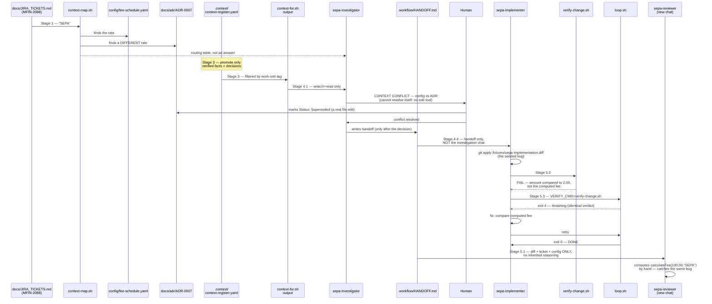
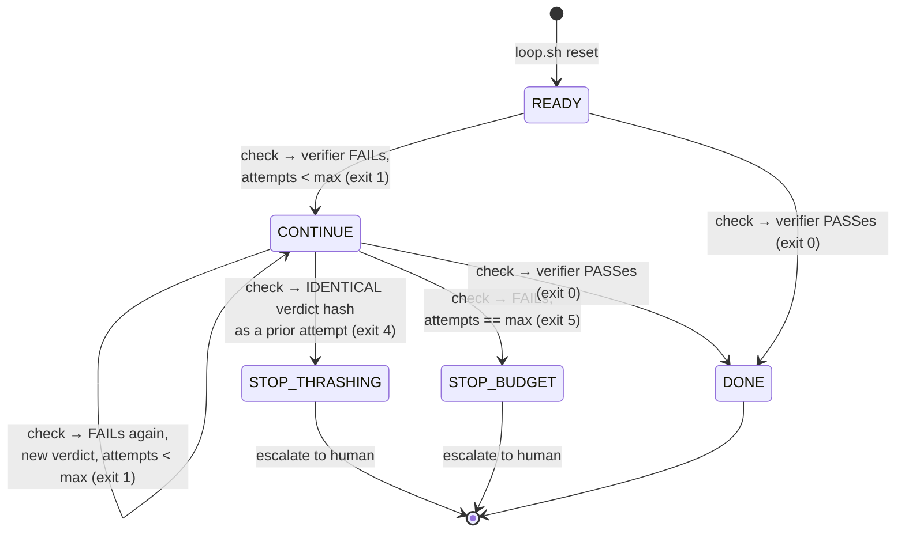

# Architecture — Context Lifecycle Lab

This document explains two things that are easy to conflate: the **Meridian payments
codebase** the lab is set inside, and the **lab tooling** (scripts, agents, skills,
hooks) built on top of it to teach the context lifecycle. Every relationship shown
below was verified directly against source — nothing here is inferred or idealized.

---

## 1. Repository layout

```
context-engineering-part-2/
├── LAB_ACTION_GUIDE.md          participant guide — the 7 stages
├── AGENTS.md                    portable instructions (Copilot + other agent tools)
├── pom.xml                      Java 17, JUnit 5, Mockito, PITest
│
├── src/main/java/com/meridian/payments/     ← the application under study (§2)
├── src/test/java/com/meridian/payments/     ← the one test file, deliberately incomplete
│
├── config/fee-schedule.yaml     authoritative fee rates — the "wins the argument" source
├── docs/adr/ADR-0007-...md      a stale, never-superseded draft rate — the seeded conflict
├── docs/JIRA_TICKETS.md         MFIN-2088 — the lab's one ticket
├── docs/VERIFICATION.md         pre-delivery checklist (automated + manual)
├── docs/TROUBLESHOOTING.md      fallbacks per stage
├── docs/verify.sh               Part A of VERIFICATION.md, automated
│
├── fixtures/sepa-implementation.diff   the seeded bug, as a patch — applied in Stage 4
│
├── scripts/                     ← the lab tooling (§3)
├── .github/agents/               3 restricted-capability Copilot agents (§3)
├── .github/skills/                4 skills, each wrapping one script (§3)
├── .github/hooks/                 SessionStart + PreToolUse enforcement (§3)
├── .github/instructions/java.instructions.md   path-scoped Java rules
│
├── .context/                    the promoted-facts register (Stage 3)
├── .workflow/                    handoff + loop state, on disk not in chat (Stage 4/5)
└── outputs/stage-readings.template.md   participant's own measurements
```

---

## 2. The Meridian payments codebase

This is the application the lab's scripts and agents operate on. It's deliberately a
mix of real dependencies, dead ones, and duplicated logic — the lab's early stages
exist specifically to teach the difference.



**Reading this diagram is Stage 1's whole lesson.** `grep` finds `LegacyPaymentUtils`
three times in `PaymentService.java` (an import, two comments) and looks like a live
dependency. `jdeps` — reading bytecode, not text — finds zero. The dashed red edge is
that gap made visible: text-tier evidence says one thing, bytecode-tier evidence says
another, and the compiler is right.

The dashed amber edge (`PaymentService` → `CurrencyConverter`) is a different kind of
gap: `CurrencyConverter` is real, correct, and unused — `PaymentService.processPayment()`
duplicates its FX conversion logic inline instead, a real bug pattern (magic numbers
`USD_TO_EUR = 0.92` etc.) that has nothing to do with the compiler being wrong.

---

## 3. The lab tooling: scripts → skills → agents → hooks

Four layers sit on top of the codebase above. Each script does one deterministic thing;
skills wrap a script in a `context: fork` boundary so its output — not its execution —
is what enters the conversation; agents wrap skills behind a restricted tool list; hooks
enforce a couple of the same rules at the tool-call level, independent of any agent.

Every box in the "tools" cluster below is something the JDK, Maven, or git already
provide. Nothing here shells out to Python, or to anything else that isn't already a
prerequisite for building Java with Maven — deliberate, since this lab's actual audience
is Java engineers, not people who happen to have a Python environment set up.



**Why `sepa-investigator` has no `edit` in its tool list isn't a convention — it's the
whole point of Stage 4.** An instruction not to edit is a request the model could ignore
mid-task. A tool that's absent from the frontmatter is a capability that doesn't exist.
`sepa-reviewer` is restricted the same way, for the same reason, one stage later.

---

## 4. Data flow across the 7 stages

This is the actual sequence of artifacts, not the narrative — what gets written, where,
and what reads it back.



**The two verification paths in Stage 5 are deliberately redundant, not sequential.**
`sepa-reviewer` catches the bug by reasoning from a curated package; `verify-change.sh`
catches the identical bug by actually calling the compiled method through `jshell`. The
lab pairs them because a comment can correctly describe a rule while the code next to it
violates it — recall isn't adherence, so neither check substitutes for the other.

---

## 5. `loop.sh`'s state machine

The bound that governs Stage 5.3, independent of which verifier it's wrapping:



State lives in `.workflow/state.json` — a file, not the model's memory. `loop-bound.sh`
(a hook) reads the same file and denies further edit tool calls once `status` reaches
either `STOP_*` value, which is the difference between *the agent is told to stop* and
*the agent cannot proceed* — the same rule enforced at two different rungs.

---

## Known gaps in this document's subject matter

This architecture is accurate to what's built, not a claim that what's built is bug-free.
See the lab's own `docs/TROUBLESHOOTING.md` and the project history for known issues,
including: `context-run.sh search`'s dedup can silently drop a second genuine hit in the
same file, and `context-map.sh`'s test-file check doesn't strip comments the way
`test-gap.sh` (its sibling script) insists on doing. Both are real, open, and not yet fixed.

---

*Copyright 2026 Arula.AI (InRhythm Arula Labs). All Rights Reserved. | Internal - Confidential*
